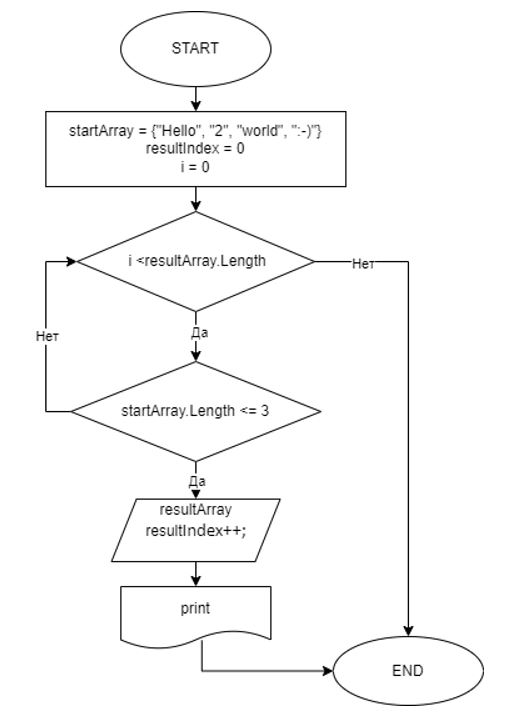

# Итоговая контрольная работа по основному блоку

1. Создать репозиторий на GitHub
2. Нарисовать блок-схему алгоритма (можно обойтись блок-схемой основной содержательной части, если вы выделяете её в отдельный метод)
3. Снабдить репозиторий оформленным текстовым описанием решения (файл README.md)
4. Написать программу, решающую поставленную задачу
5. Использовать контроль версий в работе над этим небольшим проектом (не должно быть так, что всё залито одним коммитом, как минимум этапы 2, 3, и 4 должны быть расположены в разных коммитах)

## Задача: 
_Написать программу, которая из имеющегося массива строк формирует новый массив из строк, длина которых меньше, либо равна 3 символам. Первоначальный массив можно ввести с клавиатуры, либо задать на старте выполнения алгоритма. При решении не рекомендуется пользоваться коллекциями, лучше обойтись исключительно массивами._

## Примеры:
+ [“Hello”, “2”, “world”, “:-)”] → [“2”, “:-)”]
+ [“1234”, “1567”, “-2”, “computer science”] → [“-2”]
+ [“Russia”, “Denmark”, “Kazan”] → []

## Решение
1. Составляем Блок-схему

2. Пишем программу. 
+ создаем рабочую консоль в интегрированном терминале
+ вводим исходный массив, в нашем случае три из примера оставляя два закомментированными, а третий рабочий  

    _string[] startArray = {"Hello", "2", "world", ":-)"};  
    string[] startArray = {"1234", "1567", "-2", "computer science"};  
    **string[] startArray = {"Russia", "Denmark", "Kazan"};**_
+ создаем итоговый массив, который будет содержать строки с заданным условием  
_**string[] resultArray = new string[startArray.Length];  
int resultIndex = 0;**_
+ запускаем цикл с поиском элементов массива по заданным параметрам, найденные элементы формируют итоговый массив  
_**for (int i = 0; i < startArray.Length; i++)  
{
    if (startArray[i].Length <= 3)  
    {
      resultArray[resultIndex] = startArray[i];  
      resultIndex++;
       }
}**_ 
+ выводим результат на консоль  
_Console.Write("[“Hello”, “2”, “world”, “:-)”] → ");  
Console.Write("[“1234”, “1567”, “-2”, “computer science”] → ");  
**Console.Write("[“Russia”, “Denmark”, “Kazan”] → ");  
Console.Write("[");  
for (int i = 0; i < resultIndex; i++)  
    {  
        Console.Write($"“{resultArray[i]}”, ");  
    }  
    Console.Write("]");**_

